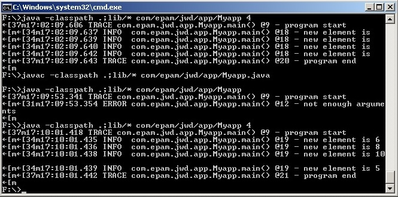
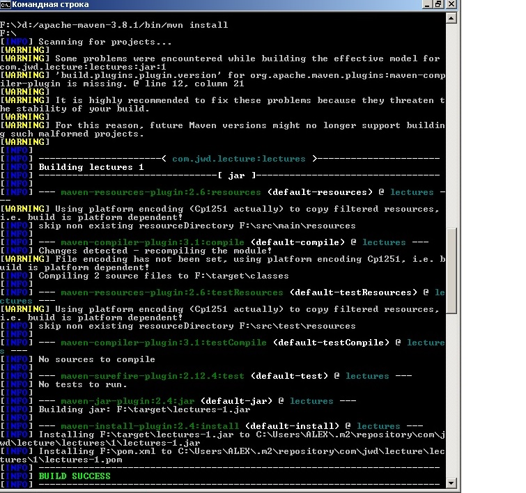

1. mkdir

3. javac -classpath .;lib/* com/epam/jwd/app/Myapp.java
   java -classpath .;lib/* com/epam/jwd/app/Myapp 4
   

   
5. javac -d app/ -classpath .;lib/* com/epam/jwd/app/Myapp.java
   java -classpath ./lib* com.epam.jwd.app.Myapp 4
   
   
6. mvn install
   
